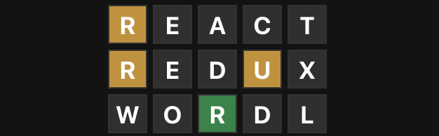

# React-Redux Wordle
- A wordle clone built using React and Redux.
- This project was built for a FEW 2.4 Redux review project assignment.
- This branch of the project can be downloaded and run as a native desktop application.

## Run Locally In Browser
- ```git clone``` the repo
- run ```npm install``` 
- run ```npm run start```

## Run Locally as Native App with Electron
- ```git clone``` the repo
- run ```npm install``` 
- run ```npm run electron-dev```

## Create a desktop build
- ```git clone``` the repo
- run ```npm install``` 
- run ```npm run make```
- To build the app with an icon: 
```npx electron-icon-maker --input=/absolute/path/to/a/png --output=src```
- Find the app build files in the out folder.

## Ideas and design based on:
- [Wordle by Josh Wardle](https://www.powerlanguage.co.uk/wordle/)